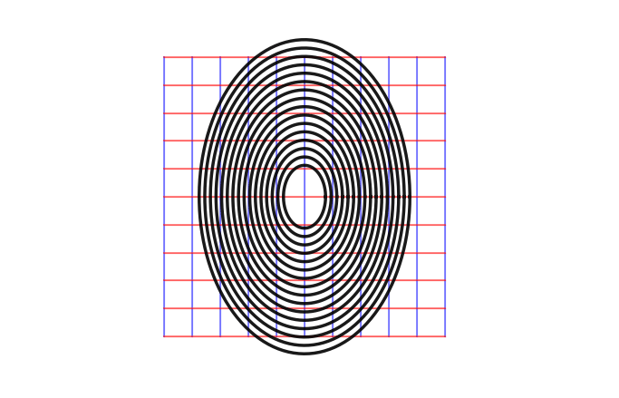

## Hi, I'm Gabriel!

I am a second year astrophysics PhD student at the University of Toronto. Much of my time is spent thinking about how galaxies merge and what we can learn about dark matter from it, which is reflected strongly in the repos you'll find here. 

🔭 I’m currently working on
  * [**tambora**](https://github.com/sgpfaff/tambora): A modernized, pythonic N-body code.
  * [**orbitflows**](https://github.com/sgpfaff/orbitflows): ML-based method for finding invertible transformations between phase-space and action-angle coordinates.

📫 How to reach me:
  * **Email**: gabriel.pfaffman@mail.utoronto.ca
<!--

**sgpfaff/sgpfaff** is a ✨ _special_ ✨ repository because its `README.md` (this file) appears on your GitHub profile.

Here are some ideas to get you started:

- 🔭 I’m currently working on ...
- 🌱 I’m currently learning ...
- 👯 I’m looking to collaborate on ...
- 🤔 I’m looking for help with ...
- 💬 Ask me about ...
- 📫 How to reach me: ...
- 😄 Pronouns: ...
- ⚡ Fun fact: ...
-->
